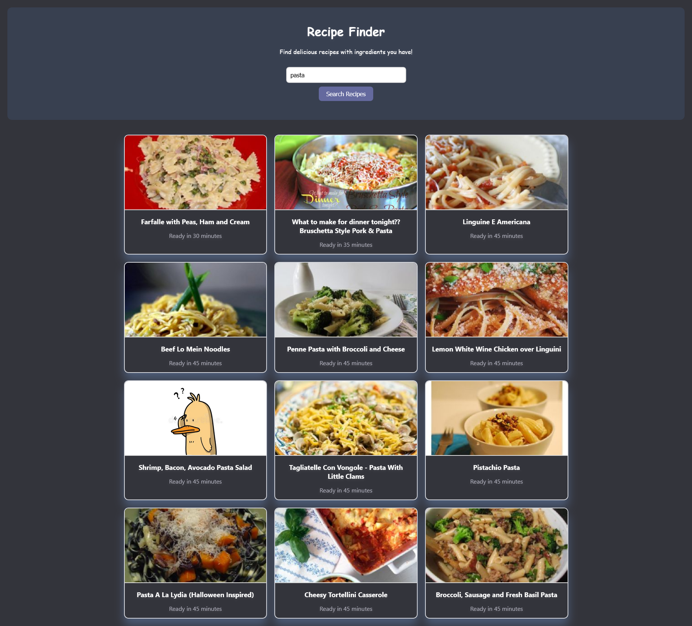

# 🍽️ Recipe Finder

Recipe Finder is a web application that allows you to **search for recipes quickly and easily** using the [Spoonacular API](https://spoonacular.com/food-api).
Just enter an ingredient or a dish name, and you’ll get a list of recipes with images, titles, and preparation time.

---

## 🚀 Live Demo

👉 [View on Vercel](https://recipe-finder-jdmora91.vercel.app/)

---

## 📸 Screenshots

### Home Page


### Search Example (Pasta)



---

## 🛠️ Tech Stack

* **React** (Create React App)
* **JavaScript (ES6+)**
* **CSS3**
* **Spoonacular API**

---

## ⚙️ Installation & Usage

1. Clone the repository:

   ```bash
   git clone https://github.com/Jdmora91/recipe-finder.git
   cd recipe-finder
   ```

2. Install dependencies:

   ```bash
   npm install
   ```

3. Add your Spoonacular API key in a `.env` file:

   ```env
   REACT_APP_SPOONACULAR_API_KEY=your_api_key_here
   ```

4. Run the development server:

   ```bash
   npm start
   ```

5. Open your browser at:

   ```
   http://localhost:3000
   ```

---

## 📦 Deployment

This project can be easily deployed to [Vercel](https://vercel.com/) or [Netlify](https://www.netlify.com/).
Make sure to configure your environment variables (API key) in the hosting platform.

---

## 🔮 Roadmap

* Improve UI/UX design with **TailwindCSS** or **Material UI**
* Add favorites feature using localStorage
* Advanced filters (time, calories, meal type)

---

## 👨‍💻 Author

Created with by [Jdmora91] (https://github.com/Jdmora91)
